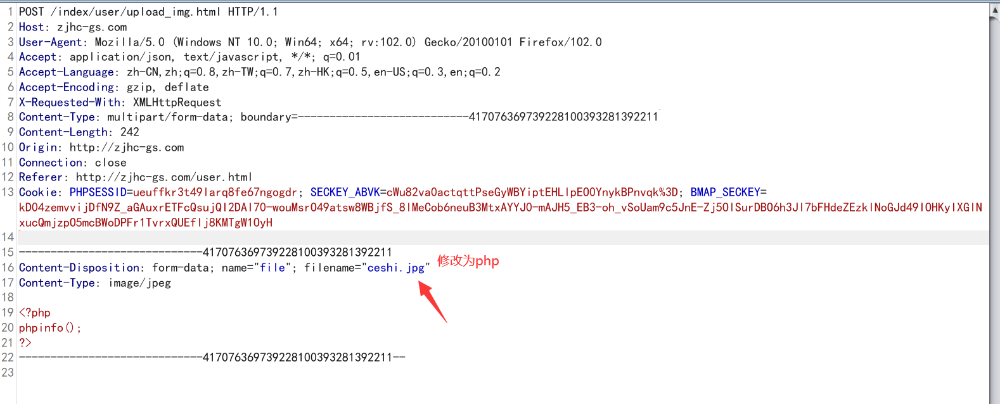
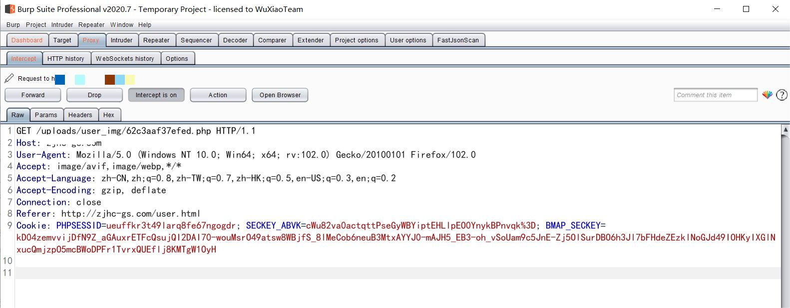
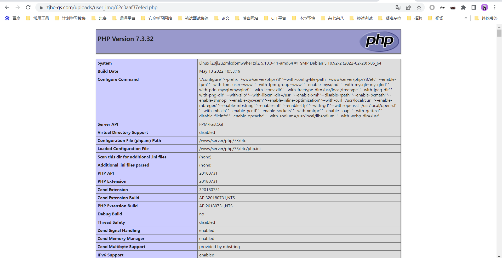

# 云景CMS文件上传漏洞

### 1、漏洞背景

云景cms是由甘肃云景数字技术有限公司开发的。YJcms（云景cms）是一个基于ThinkPHP5.0.24开发的一套开源PHP企业网站搭建管理系统，Yjcms秉承极简、极速、极致的开发理念，为开发集成了企业 、 旅游 、商城模块，可方便快速扩展的模块、插件。以方便开发者快速构建自己的应用。

### 2、漏洞利用过程

正常网站首页显示如下

```
https://zjhc-gs.com/
```


该cms有注册功能

```
https://zjhc-gs.com/user   
```

输入user会显示如下并进行跳转到登录和注册页面

![]images/58.jpg)


可以在这儿任意注册并登陆


注册好账号之后登陆后台如下


在修改头像处存在文件上传漏洞，不过这里做了前端验证，所以先将php文件改为图片格式


![]images/62.jpg)



上传成功显示如下


点击确定再抓包会返回刚才上传文件的地址

```
/uploads/user_img/62c3aaf37efed.php
```



访问该文件




