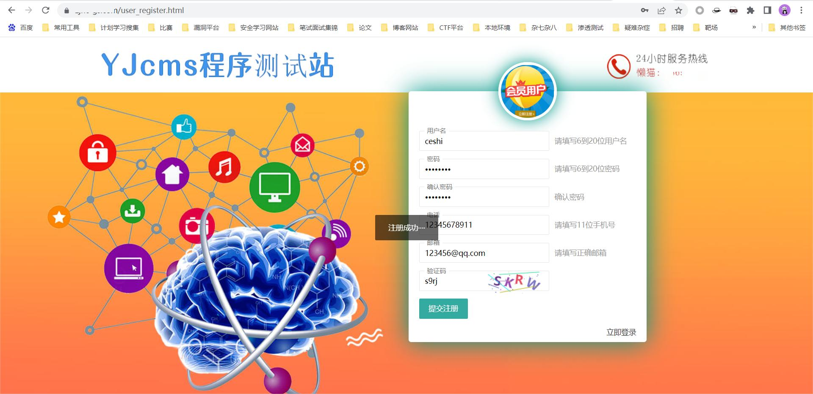
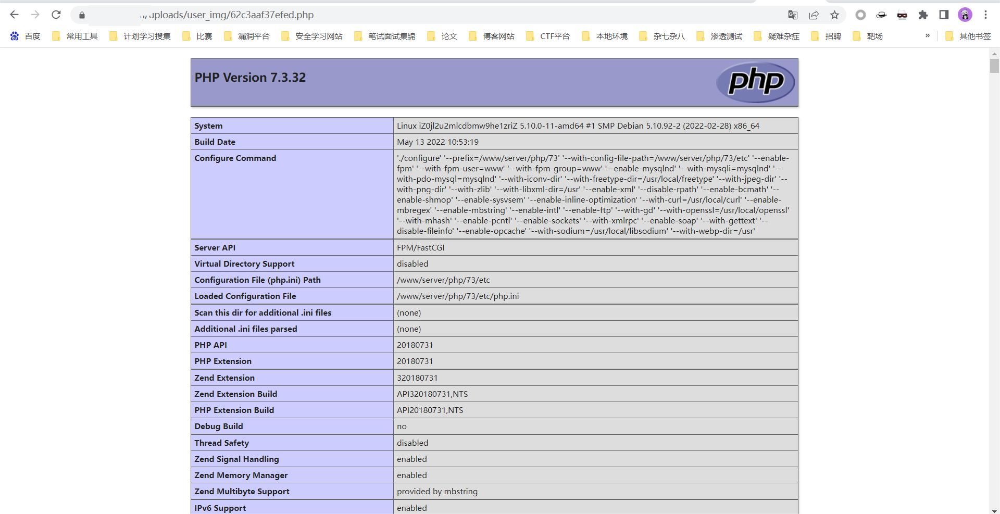

# YJCMS file upload vulnerability

### 1. Vulnerability Background

Yunjing cms is developed by gansu yunjing digital technology co., ltd. YJcms (Cloudscape cms) is an open source PHP enterprise website building management system developed based on ThinkPaPHP5.0.24. Yjcms adheres to the concept of minimalist, fast and extreme development, integrates enterprise, tourism and mall modules for development, and is a module and plug-in that can be easily and rapidly expanded. To facilitate developers to quickly build their own applications.

Address of the company's official website：http://www.xjyunjing.com/

Test targets:
```
1.https://gzyjg.cn/user_login.html
2.https://gsxwjks.com/user_login.html
```
### 2. Vulnerability exploitation process

The homepage of the normal website is shown as follows

```
https://xx.com/
```


This cms has the registration function

```
https://xx.com/user   
```

Entering the user path will jump to the login and registration page, as shown below


You can register and log in here



After registering the account, log in to the background as follows


After the account is registered, log in to the background and there is a file upload vulnerability in the modified avatar. However, the front-end verification is done here, so first change the php file to the image format


![]image/62.jpg)


The successful upload is shown as follows


Click OK to capture the package and return to the address of the uploaded file

```
/uploads/user_img/62c3aaf37efed.php
```


Accessing this file shows that the PHP file has been uploaded successfully




